# IoT機器連携 機能仕様書

本資料は[docsify](https://docsify.js.org/#/)で閲覧可能です。

# もくじ

* [IoT機器連携 機能仕様書](#iot機器連携機能仕様書)
* [もくじ](#もくじ)
* [関連資料](#関連資料)
* [用語集](#用語集)
* [配置図](#配置図)
* [ユースケース一覧](#ユースケース一覧)
* [ユースケース詳細](#ユースケース詳細)
  * [Push用トークンの取得をする](#push用トークンの取得をする)
  * [IoT機器連携用のiiideaを作成する](#iot機器連携用のiiideaを作成する)
  * [Preference設定を使用する](#preference設定を使用する)
  * [連携用Pushを受信する](#連携用pushを受信する)
  * [iiideaをアクティベートする](#iiideaをアクティベートする)
  * [iiideaを連携実行する](#iiideaを連携実行する)
  * [実行を再開する](#実行を再開する)
  * [Push用の証明書を登録する](#push用の証明書を登録する)
* [Table設計](#table設計)
  * [ER図](#er図)
* [配信管理サーバ API仕様](#配信管理サーバ-api仕様)
  * [POST /api/push/notificationToken](#post-apipushnotificationtoken)
  * [POST /api/push/acceptance](#post-apipushacceptance)
  * [POST /api/push/link](#post-apipushlink)
  * [POST /api/push/privateKey](#post-apipushprivatekey)
* [SDK API仕様](#sdk-api仕様)
  * [Push用トークンの保存API](#push用トークンの保存api)
  * [Push連携API](#push連携api)
  * [ダイアログ表示を依頼するコールバック](#ダイアログ表示を依頼するコールバック)
  * [ダイアログの表示](#ダイアログの表示)
  * [Prefreerence画面表示を依頼するコールバック](#prefreerence画面表示を依頼するコールバック)
* [ERAuth API](#erauth-api)
  * [ストアのPreference画面を開く](#ストアのpreference画面を開く)
* [AppID](#appid)

# 関連資料

* Phase2資料
  * [IoT機器連携Phase2 開発項目ロードマップ](https://drive.google.com/file/d/1G_1nyhKxItPDB1AJf5Luj-IwiNP9rpnp/view?usp=sharing)
  * [IoT機器連携Phase2 画面遷移図](https://drive.google.com/file/d/1gLSqYIcU56gPYl5nYYEW0A_PU6vwaHVe/view?usp=sharing)
  * [IoT機器連携Phase2 開発項目](https://docs.google.com/spreadsheets/d/1k463kHerzz8UqVaPpKd9RNxZFJA5MUad8syL5h3Lmy0/edit?usp=sharing)
  * [Riiiver_DB_構成図](https://drive.google.com/file/d/1Mf7zTeDSHlHQmZAkdepr7wrS_onsiFNv/view?usp=sharing)
* Phase1資料
  * [IoT機器連携Phase１ 機能一覧](https://docs.google.com/presentation/d/1oe-0Ednbs1jyU0N1rdV6BP3IoANVG1TDtBZVITCTy40/edit?usp=sharing)

# 用語集

| 用語       | 説明                               |
|------------|------------------------------------|
| Iot-Iiidea | IoT機器連携に対応したiiideaのこと        |
| 配信管理サーバ | IoT機器連携で使用するプッシュ通知機能を持つサーバのこと |
| NotificationToken | iOS, Androidでプッシュ通知を行うときに必要となるトークンのこと。デバイストークンとも呼ばれる |

# 配置図

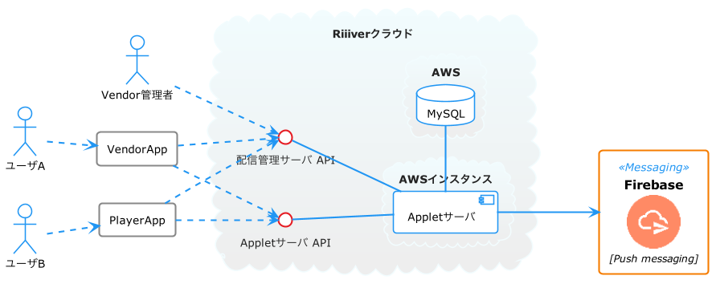

* IoT機器連携開発で、配信管理サーバが追加されるが、実際のサーバアプリが追加するのではなく、既存のAppletサーバに追加する。（既存のAppletサーバのAPIに対して、配信管理サーバのAPIを追加する）

# ユースケース一覧

以下のドキュメントを参照のこと。

[IoT機器連携Phase2 開発項目](https://docs.google.com/spreadsheets/d/1k463kHerzz8UqVaPpKd9RNxZFJA5MUad8syL5h3Lmy0/edit?usp=sharing)

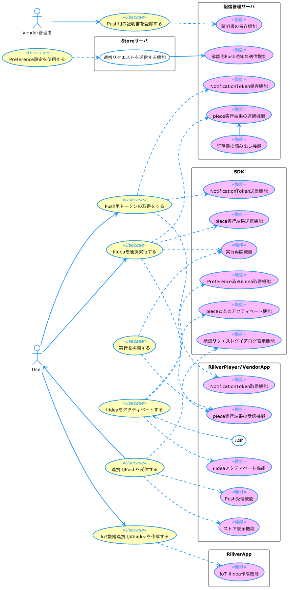

# ユースケース詳細

## Push用トークンの取得をする

### シーケンス図

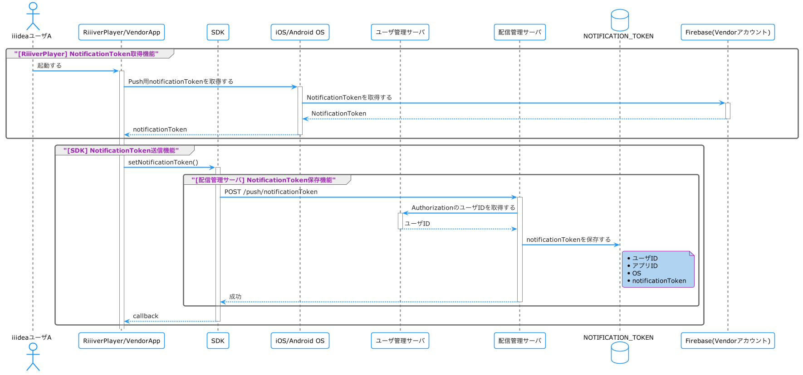


## IoT機器連携用のiiideaを作成する

RiiiverAppにIoT機器連携用のiiideaを作成する機能を追加する。

従来のiiideaは、1つのデバイスに紐づくpieceのみで構成されていた。
IoT機器連携対応のiideaでは、構成するそれぞれのpieceが異なるデバイスに紐づいている可能性がある。
そのため、従来の画面構成を変更する。

### 変更のある画面の説明

* ベンダ・デバイス選択画面
  * 既存のベンダ・デバイス選択画面は表示しない
  * （Top画面から直接TSA選択画面に遷移するように変更する）
* piece選択画面
  * pieceの表示方法を、デバイスごとにまとめて表示するようにする
  * piece検索条件画面を表示するボタンを追加する
* piece検索条件画面（新規）
  * デバイスを選択する画面
  * ベンダの下にデバイスをリスト表示する
  * 「OK」を押下して、選択されているデバイス（検索条件）を端末に保存する
  * 検索条件はログアウト時に削除する
  * いずれか1つでもデバイスが選択されていないときは「OK」を押下できないようにする

### シーケンス図

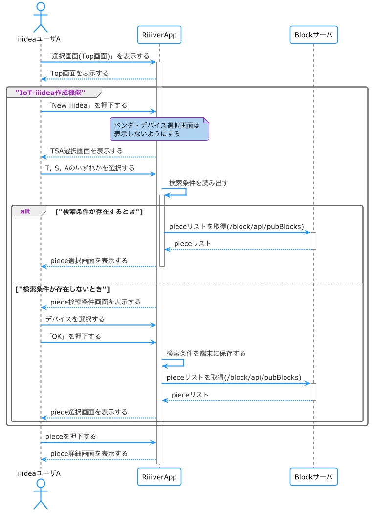


## Preference設定を使用する

### シーケンス図

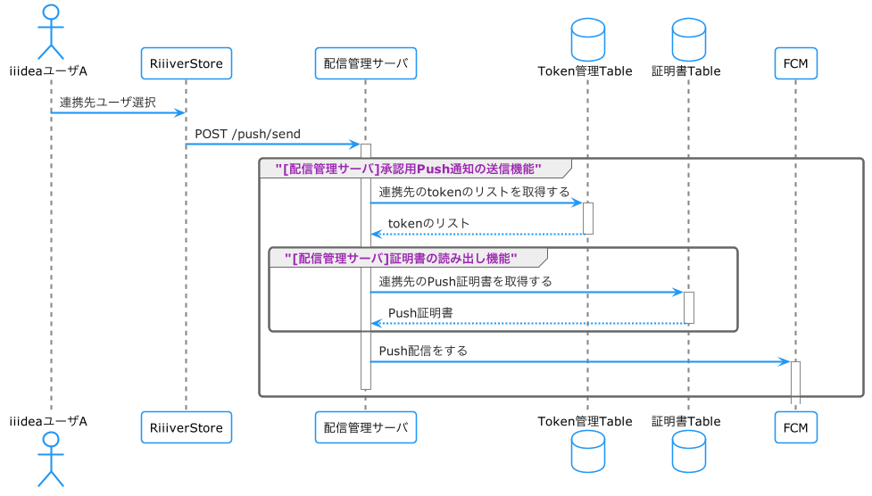


## 連携用Pushを受信する

* IoT連携に関わるコールバックをまとめた ERDeviceLinkDelegate を追加する
  * `requsetOpenDialog(request: Bundle/Dictionary)`
    * ダイアログ表示が必要な時にコールバックされる
    * ダイアログ表示に必要なデータが request に格納されている
    * iOSは必要ないため定義しない
  * `requestOpenPreference()`
    *  Web上のPreference編集画面を開く必要がある時にコールバックされる
* Android では Local Notification の作成に使用する設定情報を付与するAPIを追加する
  * `ERSDK.setNotificationConfig()`
    * アイコン画像、バイブレーション、ライトの設定が可能
    * 未設定の場合、デフォルト値で作成する
      * アイコンが未定義のときは`executeForDeviceLink()`実行時に例外を発生させる

### シーケンス図

### Android

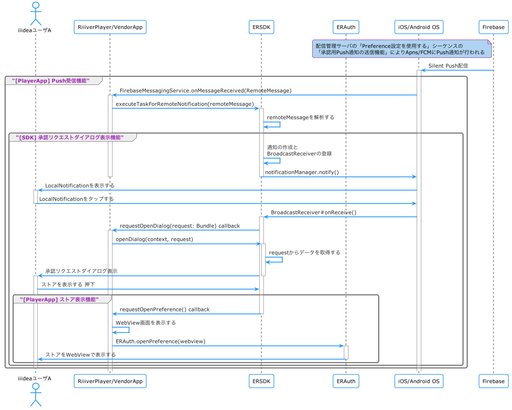

### iOS

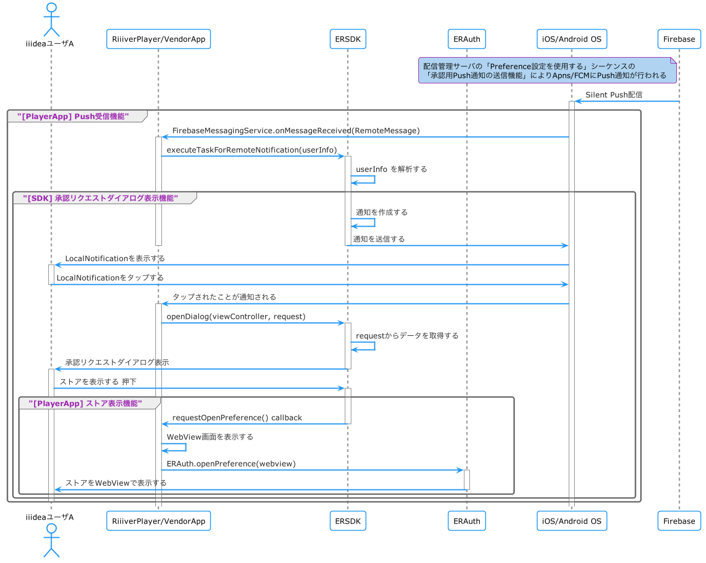

## iiideaをアクティベートする

### 説明

#### [SDK] Preference済みiiidea取得機能

* アプリから見た既存の`ERSDK#getApplet(appletId)`は動作を変えない
* SDK内部処理としては、`ERSDK#getApplet(appletId)`では、ユーザ管理サーバの新規APIである「Preference取得API」を呼び出す
* 「Preference取得API」のレスポンスBodyの以下をPreferenceとして扱う
  * `trigger_preference`
  * `service_preference`
  * `action_preference`
* 上記Preferenceをそれぞれ以下の既存APIを使用してセットする
  * `ERApplet#setTriggerBlockUserPref()`
  * `ERApplet#setServiceBlockUserPref()`
  * `ERApplet#setActionlockUserPref()`

### シーケンス図

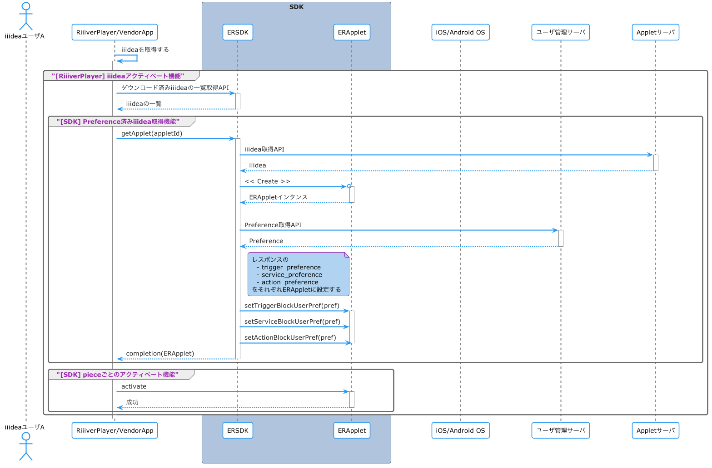


## iiideaを連携実行する

従来のiiideaの場合は、iiideaが実行されたときはT piece, S piece, A pieceが順番に
実行されていき、それぞれのpieceのアウトプットは次のpieceのアウトプットとなる。

IoT-iiideaの場合は、iiideaが実行されたときにT, S, Aの順番に実行されるのは
変わらないが、例えばユーザAの端末でT pieceが実行された後に、S pieceは
ユーザBの端末が実行する。

つまり、T pieceやS pieceのアウトプットを別のユーザに連携する必要がある。

### シーケンス図

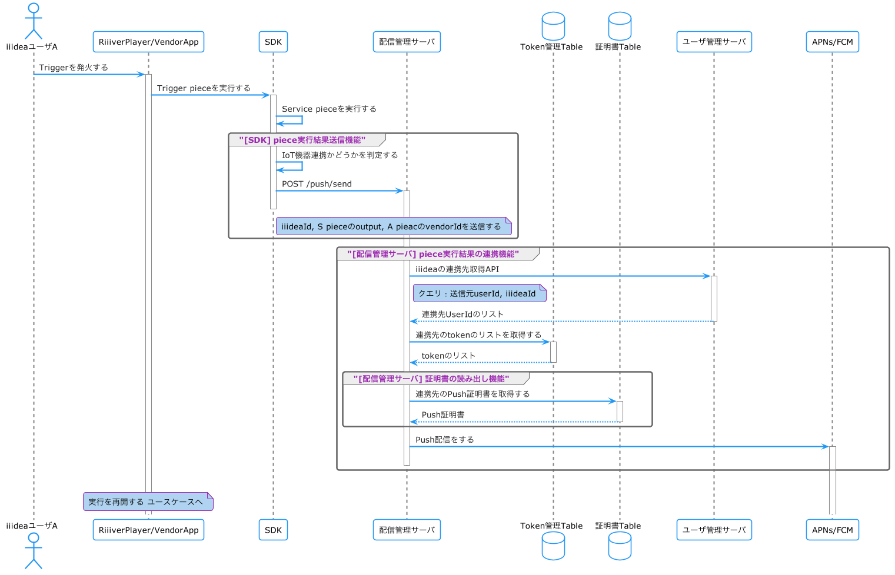

## 実行を再開する

### シーケンス図

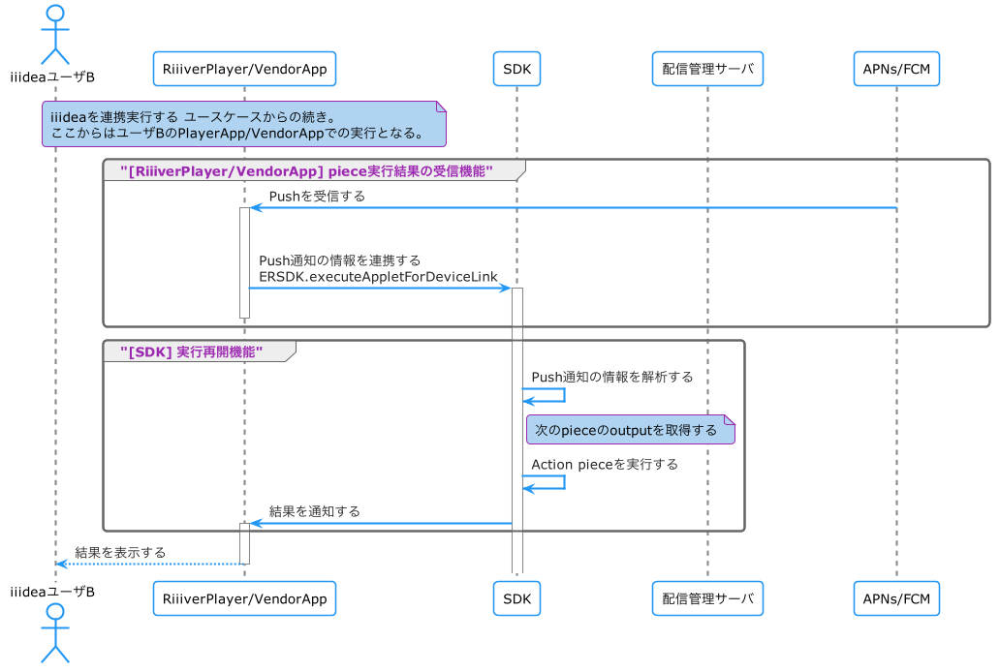

## Push用の証明書を登録する

### シーケンス図

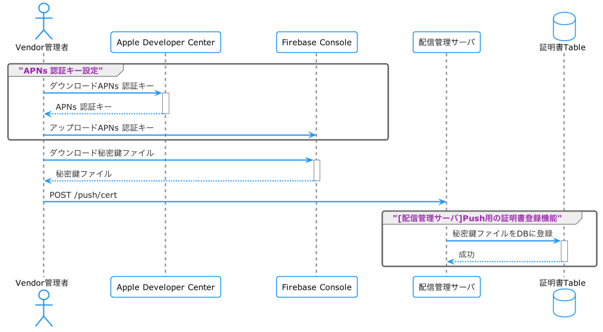

# Table設計

## ER図


# 配信管理サーバ API仕様

## POST /api/push/notificationToken

プッシュ通知のNotification Tokenの登録を行う。

使用するユースケースは、[Push用トークンの取得をする](#push用トークンの取得をする)を参照のこと。
[Swagger](/api/swagger/swagger.yaml#L1314)

* End point
```
POST /api/push/notificationToken
```

* Header
```
Authorization: JWTToken
Content-Type: application/json
```

* Body
```json
{
    "notificationToken": "string",
    "appId": "string",
    "osType": "string" //"iOS" or "Android" 
}
```

## POST /api/push/acceptance

承認用Push通知をFirebaseに依頼する。

使用するユースケースは、[Preference設定を使用する](#preference設定を使用する)を参照のこと。

* End point

```
POST /api/push/acceptance
```

* Header

```
Content-Type: application/json
```

* Body

```json
{
  "type": "link",           //承認リクエスト="link", 連携解除="unlink"
  "ownerUserId": "string",  //連携元ユーザ
  "userId": "string",       //連携先ユーザ（このユーザにPush配信する）
  "appId": "string",
  "appletId": "string",
  "blockId": "string"       //オプション
}
```

## POST /api/push/link

pieceの実行結果を受け取る。

使用するユースケースは、[iiideaを連携実行する](#iiideaを連携実行する)を参照のこと。

* End point

```
POST /api/push/link
```

* Header

```
Authorization: JWTToken
Content-Type: application/json
```

* Body

```json
{
    "appletId": "string",
    "userPreferenceId": "string",
    "nextBlockId": "string",
    "nextInput": {  //object
    }
}
```

## POST /api/push/privateKey

Firebaseの秘密鍵の登録を行う。

使用するユースケースは、[Push用の証明書を登録する](#push用の証明書を登録する)を参照のこと。

* End point
  
```
POST /api/push/privateKey
```

* Header

```
Content-Type: application/json
```

* Body

```json
{
    "appId": "string",
    "vendorId": "string",
    "firebaseProjectId": "string",
    "firebasePrivateKey": "string" 
}
```

# SDK API仕様

## Push用トークンの保存API

### 定義

```
ERSDK.setNotificationToken(token: string, callback)
```

### 説明

* Push配信に必要なiOS, AndroidのデバイストークンをSDKに設定する。
* ログイン時に各ベンダーアプリでOSからデバイストークンを取得して、SDKのこのAPIを呼び出してもらう実装が必要。

### フロー

* vendorId と appId を erconfiguration.json から取得する
* 配信管理サーバの`POST /api/push/notificationToken`をリクエストする
  * このとき、取得した vendorId と appId をリクエストBodyに設定する


## Push連携API

### 定義

```
Android: ERSDK.executeTaskForRemoteNotification(remoteMessage, completion0)
iOS: ERSDK.executeTaskForRemoteNotification(userInfo, completion0)
```

### 説明

Firebaseのプッシュ通知を受け取ったときに、ERSDKにそれを通知する。
ERSDKはプッシュ通知を解析、その解析結果に従い処理を行う。

ここで行う処理は以下。

* 承認リクエストダイアログ表示処理
* 連携解除ダイアログ表示処理
* iiideaの連携実行処理

## ダイアログ表示を依頼するコールバック

### 定義

```
Android: ERSDK.requestOpenDialog(request: Bundle)
iOS: なし
```

### 説明

承認リクエストダイアログ、連携解除ダイアログを表示するため、アプリに対してダイアログ用の画面の準備を依頼するコールバック。
SDKからAppに対してコールバックする。
iOSはPush通知の仕組み上必要ないため、定義しない。

## ダイアログの表示

### 定義

```
Android: ERSDK.openDialog(context)
iOS: ERSDK.openDialog(viewController)
```

### 説明

承認リクエストダイアログ、連携解除ダイアログを表示する。

## Prefreerence画面表示を依頼するコールバック

### 定義

```
Android: requestOpenPreference()
iOS: requestOpenPreference()
```

### 説明

Preference画面を表示するための画面の準備を依頼する。
SDKからAppにコールバックする。


# ERAuth API

ERAuthについてはACCESSの実装担当ではないが、新規APIをアプリから呼び出す必要があるため、以下に記載する。

## ストアのPreference画面を開く

### 定義

```
ERAuth.openPreference(webView)
```

### 説明

ストアのPreference画面を開く

# AppID

各Appに設定されている既存の erconfiguration.json に新たに`ERAuth.AppId`要素を追加し、これを各APIや機能で使用する`AppId`(`app_id`)とする。

この`AppId`を[iiideaをアクティベートする](#iiideaをアクティベートする) 等で使用する。

* `AppId`を取得する例:

```java
public String getAppId() {
    return ERAuth.getConfig("ERAuth").optString("AppId");
}
```

* erconfiguration.json の例

```json
{
    "UserAgent": "MobileHub/1.0",
    "Version": "1.0",
    "ERAuth":{
        "Host": "https://dv-str.riiiver.com",
        "VendorId": "CITIZEN",
        "AppName": "CITIZEN",
        "AppId": "This_is_AppId"  //★この要素を追加
    },
    "FacebookSignIn": {
        ...
    },
    "GoogleSignIn": {
        ...
    },
    "SignInWithApple": {
        ...
    }
}
```

--- 以上
